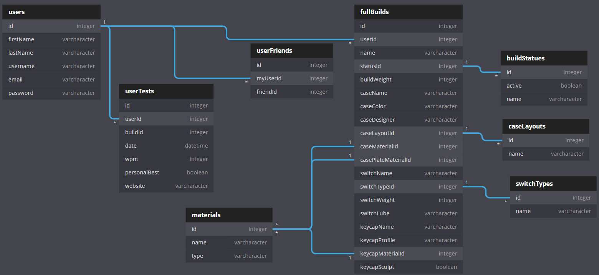

# M + K | mech köllection

*An app for cataloging and sharing your custom mechanical keyboard builds.*

## BUT WHY?

“What if I told you that underneath your keycaps there are little plastic switches?"

*You probably wouldn’t be that surprised.*

“What if I told you those switches could come in tons of different types?”

“And what if I told you that inside those switches are springs, leafs, and stems?”

“And what if I told you that people take them apart to lubricate each part before putting them back together...70 to 100 times?”

*You might be somewhat surprised.*

“And what if I told you the only reason they do that is so they can brag to other people about it?”

*You wouldn’t be the least bit surprised.*

Mechanical keyboard enthusiasts are a rare breed - they love to build, tinker, pour over details, and endlessly gatekeep each other about who’s opinion holds the most value. They spend hours researching, hundreds of dollars buying, and months waiting to get their hands on limited quantity custom keyboards that would make any rational person scoff.

The (only) surprising thing about the entire situation? They don’t have an effective way to share their collection in detail.

Oftentimes they will append their forum signatures and online handles with some shorthand version of their keyboards. This method is great for a heads-up type view, but those with large collections typically resign to only tagging their current keyboard build. Generally, a very small portion of users share their complete collection where the information is tediously typed in an online post and then never used again after the life of the posting.

Mech Collection is designed to allow users to create, save, and share their collections...with anyone that actually cares.

## PERSONAL GOALS

Create a simple but effective application that satisfies MVP yet is extremely polished. Explore central topics in much more detail without (too much) feature creep. Practice with data manipulation and visualization.

## FEATURES

### MVP

- The user can create, view, and delete keyboards in a collection.
- The user has a dashboard view as the default application view.
  - The user can see keyboards in their collection
  - The user can see typing test results
  - The user can see their friends
- The user can add and view their friends.

### STRETCH

- The user can toggle between light and dark mode on the website.
- The user can see their friends collections
- The user can upload media (audio/image) for each item in their collection.
- The user sees the keyboard icon colors respond according to their input.
- The user sees a mirror of their input while interacting with certain pages.

## TECHNOLOGIES

- Figma
- React
- Material-UI
- Firebase
  
## PLANS

### WIREFRAME

[Click here to see my Figma mockup](https://www.figma.com/file/rn6M1nlc6W6XQay7O6DqZj/Front-End-Capstone?node-id=0%3A1)

### ERD

## HOUSEKEEPING

This project was bootstrapped with [Create React App](https://github.com/facebook/create-react-app).

### Available Scripts

In the project directory, you can run:

#### `npm start`

Runs the app in the development mode. 
Open [http://localhost:3000](http://localhost:3000) to view it in the browser.

The page will reload if you make edits. 
You will also see any lint errors in the console.

#### `npm test`

Launches the test runner in the interactive watch mode. 
See the section about [running tests](https://facebook.github.io/create-react-app/docs/running-tests) for more information.

#### `npm run build`

Builds the app for production to the `build` folder. 
It correctly bundles React in production mode and optimizes the build for the best performance.

The build is minified and the filenames include the hashes. 
Your app is ready to be deployed!

See the section about [deployment](https://facebook.github.io/create-react-app/docs/deployment) for more information.

#### `npm run eject`

**Note: this is a one-way operation. Once you `eject`, you can’t go back!**

If you aren’t satisfied with the build tool and configuration choices, you can `eject` at any time. This command will remove the single build dependency from your project.

Instead, it will copy all the configuration files and the transitive dependencies (webpack, Babel, ESLint, etc) right into your project so you have full control over them. All of the commands except `eject` will still work, but they will point to the copied scripts so you can tweak them. At this point you’re on your own.

You don’t have to ever use `eject`. The curated feature set is suitable for small and middle deployments, and you shouldn’t feel obligated to use this feature. However we understand that this tool wouldn’t be useful if you couldn’t customize it when you are ready for it.

### Learn More

You can learn more in the [Create React App documentation](https://facebook.github.io/create-react-app/docs/getting-started).

To learn React, check out the [React documentation](https://reactjs.org/).

#### Code Splitting

This section has moved here: https://facebook.github.io/create-react-app/docs/code-splitting

#### Analyzing the Bundle Size

This section has moved here: https://facebook.github.io/create-react-app/docs/analyzing-the-bundle-size

#### Making a Progressive Web App

This section has moved here: https://facebook.github.io/create-react-app/docs/making-a-progressive-web-app

#### Advanced Configuration

This section has moved here: https://facebook.github.io/create-react-app/docs/advanced-configuration

#### Deployment

This section has moved here: https://facebook.github.io/create-react-app/docs/deployment

#### `npm run build` fails to minify

This section has moved here: https://facebook.github.io/create-react-app/docs/troubleshooting#npm-run-build-fails-to-minify
